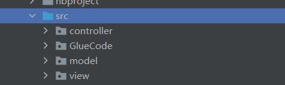
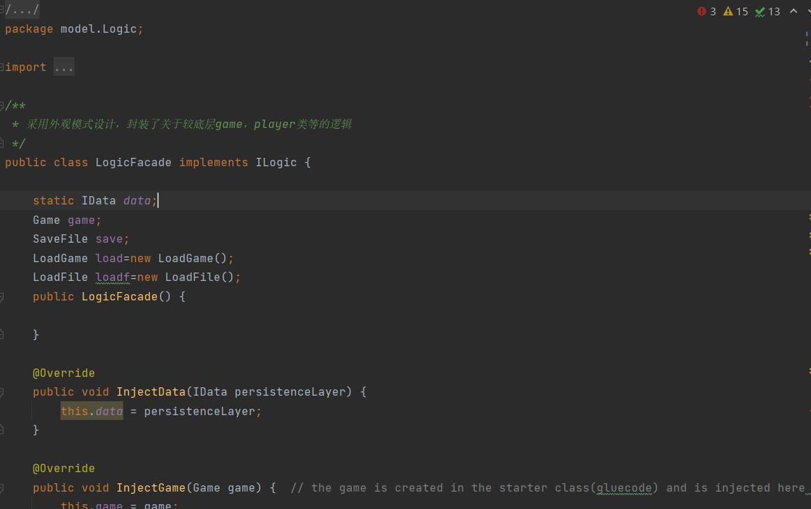

# 软件工程实践二
## 一、实践任务简述
### 1.任务要求
### 2.讨论确定功能点
## 二、项目需求分析
### 1.功能需求
### 2.非功能需求
### 3.用例图设计
### 4.数据库设计
## 三、技术路线
### 1.开发技术与框架
#### (1)主要技术和工具
* Git版本控制工具
* Github
* Maven项目工程管理
* JavaFx
* Junit单元与集成测试
* DevOps软件开发过程
* MySQL数据库
* MarkDown
#### (2)项目框架简介
World of zuul项目的构建主要使用了Maven软件项目管理构建工具,通过其组织和关系项目的依赖关系,构架和打包应用程序。同时本游戏使用JavaFX来构架跨平台桌面应用程序的GUI界面,其具有跨平台支持、现代化的图形和控件、富媒体支持、灵活的布局管理、强大的图形渲染引擎、CSS 样式支持以及丰富的集成能力等优点。在实践项目的pom.xml 配置文件中定义了项目的依赖项,包括所需的库和版本号。

在实践过程中充分利用 Maven 和 JavaFX 的优势,提高开发效率、简化依赖管理,创建出稳定的易维护的应用程序。
### 四、设计模式
World of zuul项目中采用MVC模式,同时在写后端逻辑时采用了外观模式的Java设计模式。
#### (1)MVC模式
该项目中的 MVC模式将系统分为了三个逻辑部分:
* Model层:包含游戏的逻辑处理和数据管理,例如玩家角色、房间、NPC等。
* View层:包含游戏的GUI界面呈现和交互事件处理,例如游戏界面、JavaFX界面控件、按钮、文本框、项目图片等。
* Controller层:连接Model层和View层,协调游戏逻辑和视觉效果的交互配合,监听 View 层的事件,传递相应的指令到 Model 层对游戏进行相应更新。

上图是本项目的代码结构,其中GlueCode包下为程序入口,其余前后端的实现通过MVC设计模式进行组织
#### (2)外观设计模式
项目中的LogicFacade类是一个实现了ILogic接口的类,对逻辑层进行封装,提供了一个简化的接口给客户端使用,其为外观设计模式中的外观类。

在该类中,它通过实现ILogic接口提供了一组高级接口,使客户端能够执行各种游戏逻辑和操作。它包含了对IData接口的调用,用于与数据持久化层进行交互。同时,它还与Game、Player和其他类进行交互,将客户端的请求委托给相应的对象处理。
LogicFacade类的目的是隐藏底层系统的复杂性,并提供一个统一的接口供客户端使用。客户端不需要了解底层系统的具体实现细节,只需要调用ILogic接口中定义的方法即可完成相应的操作。
而在FXMDocumentLcontroller类中对Logic进行调用,从而避免了其与player等类的操作直接接触,而通过外观提供的简单接口进行调用。

在本项目外观模式设计类图如下所示

## 五、小组开发过程(通过github开展)
### 1.小组任务分工
我们具体任务分工如下:
* 武奥妮:小组组长,负责设计Player类及其操作,以及游戏的保存与加载(通过数据库实现),负责代码评审和集成部署操作
* 钱玉力:负责使用JavaFX构建游戏所需前端GUI界面,完成前端部分的测试。
* 卢丹:负责游戏中NPC类以及ITEM类的设计和实现,负责前后端交互以及后端测试。
* 吴架:负责项目需求分析的具体设计,实现Game类中的具体游戏命令。
通过github上的issue功能为小组每个成员划分具体的任务,如下图所示

### github开发过程
## 主要功能实现细节
## 单元测试
## 结果展示
## 实验总结

